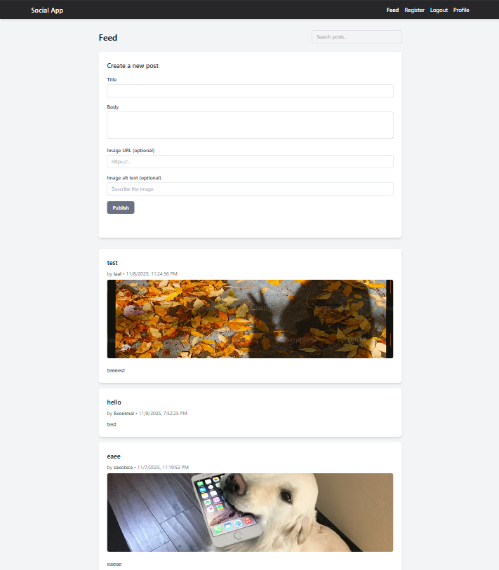

<p>
  
</p>

# Social Media Application

A responsive front-end social media app built with Tailwind CSS for the CSS Frameworks course at Noroff.

Users can register, log in, create posts, edit or delete their own posts, follow other users, and view user profiles.

---

## Getting Started

### Install dependencies

```bash
npm install
```

### Run Tailwind in development mode

```bash
npm run dev
```

### Build for production

```bash
npm run build
```

---

## Available Scripts

```bash
npm run dev              # Start Tailwind in watch mode
npm run build            # Build and minify CSS for production
```

---

## Technologies used

-HTML5
-CSS3
-Tailwind CSS
-JavaScript (ES Modules)
-Node.js & npm

---

## Folder Structure

social-media-application/
├── src/
│ ├── api/
│ ├── components/
│ ├── pages/
│ ├── utils/
│ └── css/
│ ├── input.css
│ └── style.css
│
├── index.html
├── feed.html
├── post.html
├── profile.html
├── register.html
├── logout.html
├── main.js
│
├── favicon.ico
├── package.json
├── package-lock.json
└── README.md

---

## Features

-Responsive layout using Tailwind
-Authentication forms with built-in HTML validation
-Feed page displaying posts dynamically
-Create post form with optional image upload fields
-Profile page with user info and posts
-Consistent design across all pages

---

# Author

Arnt Helge Vold
Vold-Art @ GitHub
FED2 | Noroff
